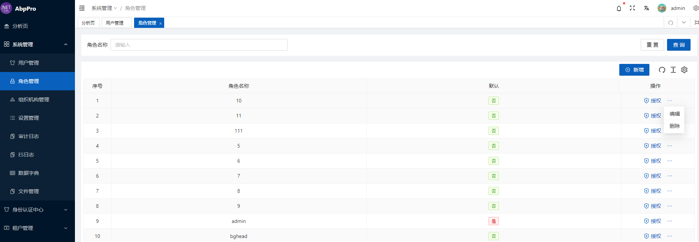
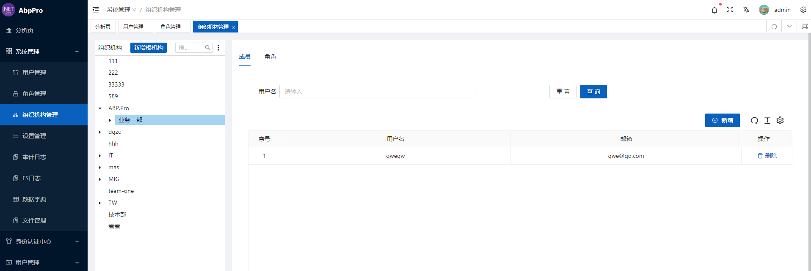

# 身份管理模块

- 身份模块基于 [Microsoft Identity](https://docs.microsoft.com/zh-cn/aspnet/core/security/authentication/identity?view=aspnetcore-6.0) 库 用于管理角色,用户及其权限.

## 用户
- 此页用于查看用户列表. 您可以创建/编辑和删除用户, 将角色分配给用户。

- 一个用户可以有零个或多个角色. 用户从其角色继承权限 。

## 角色
- 角色用于按分组给用户分配权限.

- 角色除了角色名称之外还有2个属性:
    - Default: 如果某个角色被标记为 "default", 那么当新用户注册到应用程序时, 其将被作为默认角色分配给新用户.
    - Public: 用户的公共角色可以被应用程序中的其他用户看到. 这个功能在身份模块中没有用到, 但被提供作为你可能希望在你自己的应用程序中使用的功能.

## 组织单元
- 组织单元由 OrganizationUnit 实体表示. 它的基本属性是:
    - TenantId: 组织单元的租户Id. 对于宿主可以是 null.
    - ParentId: 父级组织单元的Id. 如果这是一个根级组织单元，它可以是 null.
    - Code: 对于租户唯一的层级字符串编码.
    - DisplayName: 组织单元的显示名称.

### 组织树
- 由于组织单元可以有父级, 因此租户的所有组织单元是一个 树 结构. 这个树有一些规则;
- 可以有多个根级 (ParentId 是 null 的) .
- 一个组织单元的第一级子项数量有限制 (因为下面解释的固定的组织单元编码单位长度) .

### 组织单元编码
- 组织单元编码是通过 OrganizationUnitManager 服务自动生成和维护的. 它是一个字符串, 像这样:"00001.00042.00005"
- 通常用这种编码可以轻易地 (递归) 查询出数据库中组织单元的所有子项. 这个编码有一些规则 (当你使用 OrganizationUnitManager 时自动被应用的) :
- 对 租户 是 唯一的.
    - 同一组织单元的全部子项都具有 以父级组织单元编码开头的 编码.
    - 如示例中所示, 它是固定长度的且是基于树中组织单元的级别的.
    - 尽管组织单元编码是唯一的, 但如果你移动了相关的组织单元, 它也可以被更改.
    - 请注意, 你必须根据Id引用一个组织单元, 而不是编码, 因为编码后续是可以被更改的.
    

